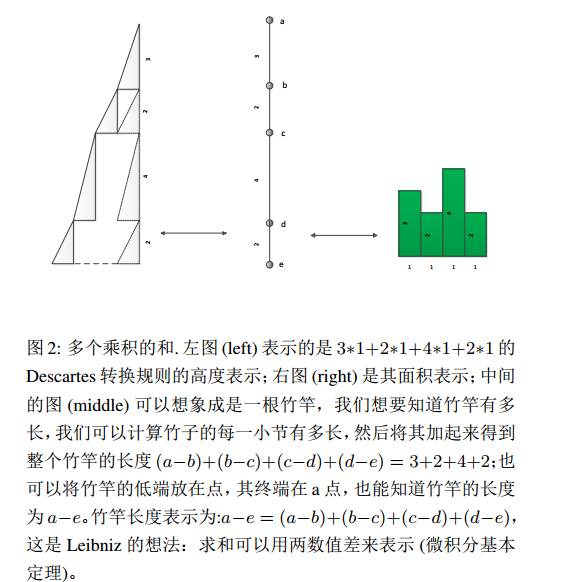

## Calculator
微积分简介:无穷小量方法。

无穷小量，一种类似于原子的观点。

## Example

more see:calculator.pdf

## Visualization
可以像 [Seeing-Theory](https://github.com/seeingtheory/Seeing-Theory) 这个项目一样进行动态可视化。

## Copyright and License
这个项目仅仅用于教育，不可用于其他非教育用途。
